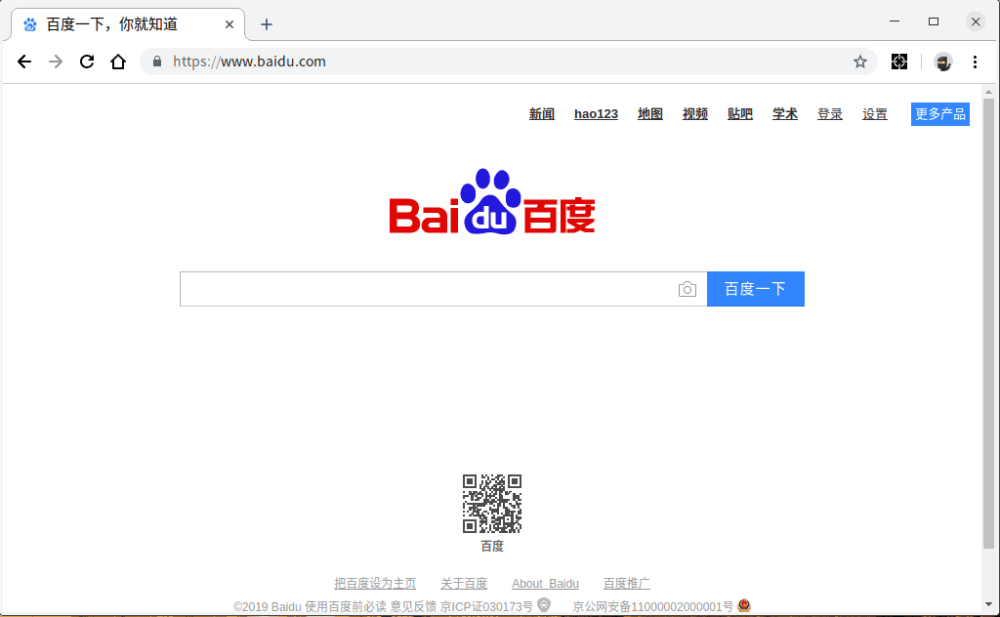

# MockInput

测试的时候不断的录入符合要求的手机号码，身份证号码，姓名。烦的要死，一直录入测试、点点点啥的出来的数据有难看，所以做了这个浏览器的插件。发布chrome商店要5刀，而且应用太挫，自用勿吹。

# 使用方法

由于不在应用商店，所有要自己加载插件包。
打开chrome浏览器之后，右上角三个点 > 更多工具 > 拓展程序
打开 开发者模式，加载已解压的拓展程序，选择到根目录既可。

## 选项说明
    选项页面配置指定信息用于不需要随机信息的内容，方便快捷输入。

    实例场景：后台测试录入资料有可能产生短信通知手机号码机主的机制，请勿使用随机手机号。防止测试内容泄漏或者对正好命中的随机号码机主造成骚扰。

# 显示效果

 

# 特别声明

本工具过于简单，属于拍脑门插件。

工具中所有生成的信息都是系统随机组合而成，不具有指向性，请合理合法使用。